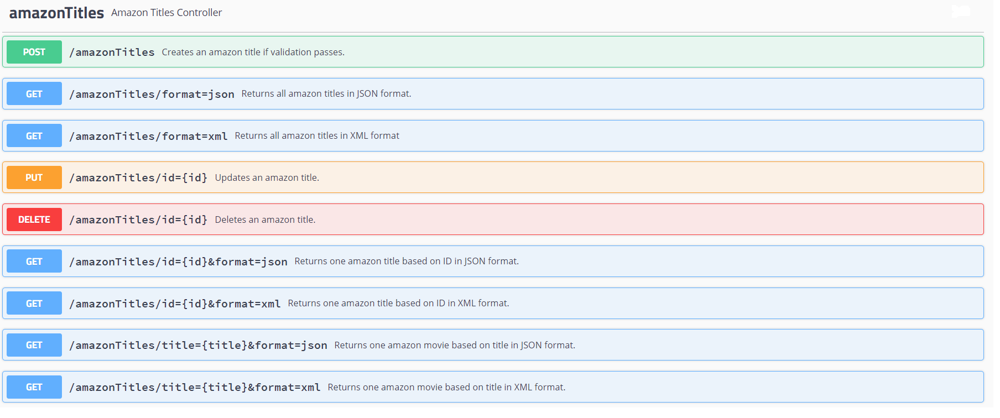
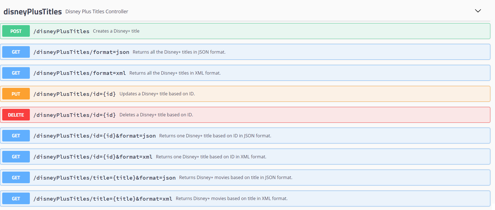
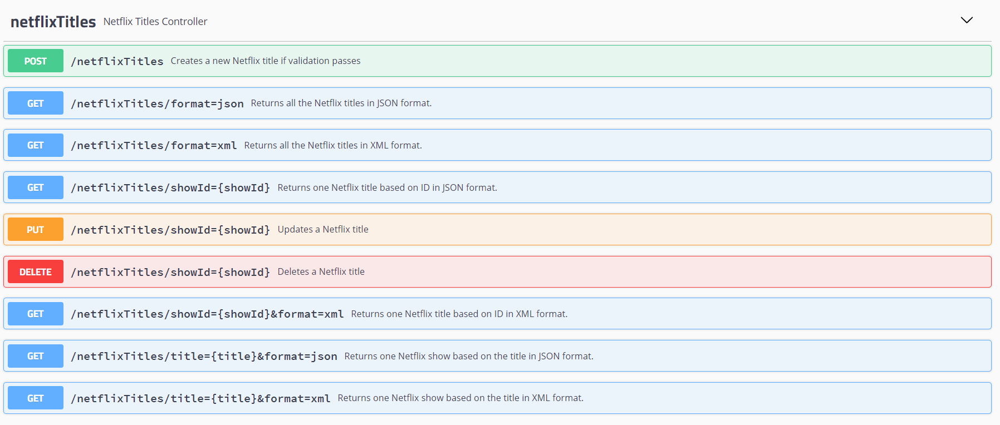

# API for class - Dataprocessing
## Made by Chris Takacs (4644530)
#### The API requires certain steps to be followed to work correctly:
1. Xampp needs to be installed and started (Apache, MySQL).
2. The user must create a database called 'dataprocessingapi' on the xampp server.
3. Open repository in and IDE (IntelliJ recommended).
4. Go to folder target and run CHR1SSW.jar in the IDE.
5. The 'Run' window will print messages, some warnings might occur. 
6. If everything went correctly the following message should be displayed:  
Started Main in x.xx seconds (JVM running for x.xx)
7. The tables and their data should be filled automatically once the .jar file started.
8. The API is ready to use.

If hosted correctly documentation should be available at [this link](http://localhost:8090/swagger-ui.html#/).
If for some reason this does not work here are some instructions on the API calls:

___

___
